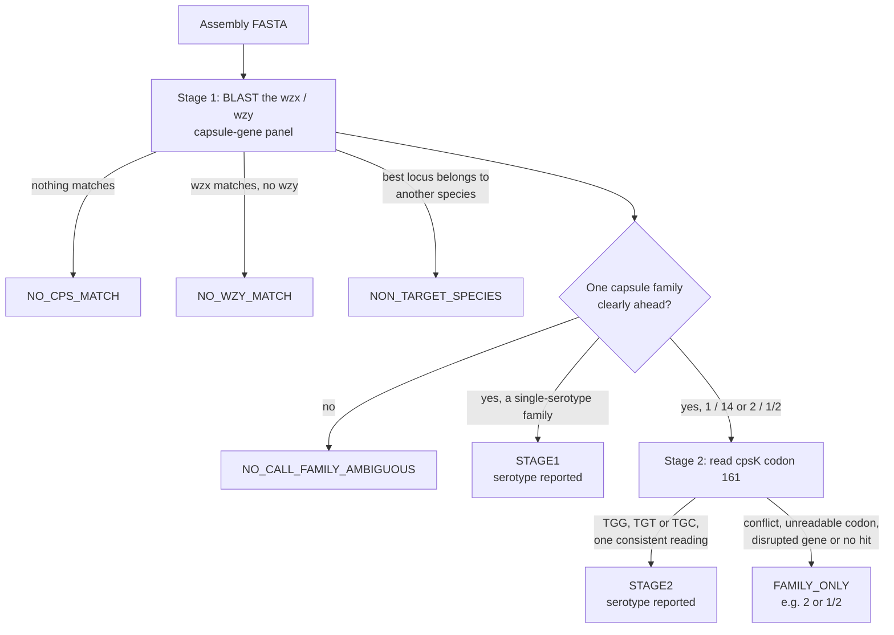

# swineotype

**Capsular serotyping of the two major bacterial pathogens of pigs, from genome assemblies.**

`swineotype` takes assembled genomes (FASTA) and reports the capsular serotype of
***Streptococcus suis*** and the serovar of ***Actinobacillus pleuropneumoniae*** (APP).
For *S. suis* it compares each assembly against a curated panel of capsule genes and,
where two serotypes share the same capsule locus, reads the single codon that tells
them apart. For APP it runs the established
[serovar_detector](https://github.com/Jacques-does-science/serovar_detector) workflow.
Every run produces one summary table with a row per assembly, plus a record of exactly
which settings and reference data produced it.

| | |
| :--- | :--- |
| **Input** | Assembled genomes, uncompressed FASTA — one file per isolate, draft or complete |
| ***S. suis*** | All 29 serotypes (1–19, 21, 23–25, 27–31 and 1/2), by BLAST against *wzx*/*wzy* capsule genes, with a codon-level resolver for 1 vs 14 and 2 vs 1/2 |
| **APP** | Serovars 1–19, by KMA against capsule genes, via a bundled Snakemake workflow |
| **Output** | `swineotype_summary.csv` (one row per isolate) and `swineotype_run.json` (versions, settings, reference checksums) |
| **Requires** | Python ≥ 3.10 and BLAST+; the APP workflow additionally needs Snakemake, conda and KMA |

## Contents

- [Installation](#installation)
- [Quick start](#quick-start)
- [Usage](#usage)
- [How it works: *S. suis*](#how-it-works-s-suis)
- [How it works: APP](#how-it-works-app)
- [Output](#output)
- [Interpreting results](#interpreting-results)
- [Configuration](#configuration)
- [Reference data](#reference-data)
- [Development](#development)
- [References](#references)

---

## Installation

You need `git` and conda (Miniconda, Anaconda or Mamba).

**1. Clone the repository with its submodule.** The APP workflow lives in a git
submodule, so `--recursive` matters:

```bash
git clone --recursive https://github.com/Jacques-does-science/swineotype.git
```

If you already cloned without it, run `git submodule update --init --recursive` inside
the repository.

**2. Create the environment.** From the repository root, this creates a conda environment
called `swineotype` (Python 3.11, BLAST+, Snakemake, KMA and supporting packages) and
installs the tool into it:

```bash
bash scripts/install_swineotype.sh
```

**3. Activate it and check the install:**

```bash
conda activate swineotype
```

```bash
swineotype --version
```

### Installing with pip only

For *S. suis* alone, any Python ≥ 3.10 environment with BLAST+ (`blastn`, `makeblastdb`)
on the `PATH` is enough:

```bash
pip install .
```

APP serotyping needs the full repository checkout — the workflow and its KMA database
are inside `third_party/serovar_detector` — so for APP, use the conda route above, or
`pip install -e .` from the checkout with Snakemake, conda and KMA available. The first
APP run lets Snakemake build the workflow's own conda environments, which needs internet
access once.

---

## Quick start

The repository ships three complete *S. suis* genomes, all serotype 2 strains
(05ZYH33, 98HAH33 and GZ1). From the repository root:

```bash
swineotype --assembly "examples/Streptococcus/*.fasta" --out_dir results_example
```

```text
Serotyping assemblies
[OK] GCA_000014305.1_ASM1430v1_genomic.fasta => 2 (STAGE2)
[OK] GCA_000014325.1_ASM1432v1_genomic.fasta => 2 (STAGE2)
[OK] GCA_000018185.1_ASM1818v1_genomic.fasta => 2 (STAGE2)
[INFO] Summary written: /path/to/swineotype/results_example/swineotype_summary.csv
[INFO] Run record written: /path/to/swineotype/results_example/swineotype_run.json
```

`STAGE2` means the capsule genes placed each genome in the 2 / 1/2 family, and the codon
that separates those two serotypes read `TGG`, which means serotype 2. The same
information, with the evidence behind it, is in the summary table:

| sample | status | final_serotype | stage1_family | triplet | triplet_status | coding_status |
| :--- | :--- | :--- | :--- | :--- | :--- | :--- |
| GCA_000014305.1_ASM1430v1_genomic | STAGE2 | 2 | 2_vs_1_2 | TGG | OK | INTACT |
| GCA_000014325.1_ASM1432v1_genomic | STAGE2 | 2 | 2_vs_1_2 | TGG | OK | INTACT |
| GCA_000018185.1_ASM1818v1_genomic | STAGE2 | 2 | 2_vs_1_2 | TGG | OK | INTACT |

Three complete APP genomes are also included, in `examples/Actinobacillus/`.

---

## Usage

```bash
swineotype --species suis --assembly "isolates/*.fasta" --out_dir results --threads 8
```

```bash
swineotype --species app --assembly "isolates/*.fasta" --out_dir results --threads 8
```

| Option | Description |
| :--- | :--- |
| `--assembly` | Assembly FASTA file(s). Required. **Quote glob patterns** (`"isolates/*.fasta"`) so swineotype expands them — an unquoted glob is expanded by the shell into extra arguments, which is an error. Repeat the option to pass several files or patterns. A pattern that matches nothing stops the run with exit code 2. |
| `--out_dir` | Output directory. Required. Created if needed. |
| `--species` | `suis` (default) or `app`. |
| `--threads` | Threads for BLAST or the APP workflow. Default: half the CPUs. |
| `--merged_csv` | Optional extra CSV that accumulates results across runs. *S. suis* rows are appended to it; an APP run merges an `app_serovar` column into it. |
| `--input_species` | A species established independently for these inputs (e.g. by ANI). Recorded in the output as given; swineotype does not measure species. |
| `--config` | YAML file overriding default settings. See [Configuration](#configuration). |
| `--version` | Print the version and exit. |

**Input.** One uncompressed FASTA per isolate; draft assemblies with many contigs are
fine. Gzipped files are not supported — decompress with `gunzip -k isolate.fasta.gz`.

**Both species in one table.** Run the two modes against the same `--merged_csv`. APP
calls are joined onto the *S. suis* rows by `sample` (the file name without extension):

```bash
swineotype --species suis --assembly "isolates/*.fasta" --out_dir results --merged_csv results/all_isolates.csv
```

```bash
swineotype --species app --assembly "isolates/*.fasta" --out_dir results --merged_csv results/all_isolates.csv
```

`--merged_csv` appends on every run, so give each batch its own path. It refuses to
append to a file written with a different column layout. Because the join is on the
file name, give every isolate a distinct one (not, say, `assembly.fasta` from several
folders) when you plan to combine the two species.

---

## How it works: *S. suis*

*S. suis* serotypes are defined by the capsular polysaccharide, whose genes sit together in
the *cps* locus. `swineotype` reads the serotype from that locus in two stages.



### Stage 1: capsule-gene screen

The assembly is searched with BLASTn against a panel of *wzx* (flippase) and *wzy*
(polymerase) genes drawn from 35 reference *cps* loci.

- **One copy, one set of numbers.** A gene may be hit by several local alignments. These
  are grouped into physical copies — same contig and strand, in order, not overlapping —
  and coverage, identity and score are all taken from the best single copy. A duplicated
  or partial extra copy neither inflates nor dilutes the evidence. A gene broken across
  contigs can still be pieced together from non-overlapping fragments; that evidence is
  flagged as split.
- **Thresholds.** A reference counts when its best copy reaches 85 % identity and 80 %
  coverage (`min_pid`, `min_cov`).
- ***wzy* is required.** *wzx* is conserved across serotypes, so a *wzx* match alone
  cannot identify one. Only a serotype whose *wzy* matched can be called; this mirrors
  the published multiplex PCR schemes, which target *wzy*. Serotype 14 is represented
  by *wzy* alone.
- **Families first.** Serotypes 1 and 14 share a *cps* locus, as do 2 and 1/2; the members
  of each pair differ at a single position in *cpsK*. Each pair is scored as one family
  (taking the best score per gene, so near-identical references are not double-counted),
  and every other serotype is its own family. The leading family must hold at least 60 %
  of all family evidence and lead the runner-up by at least 100 bits (`plurality`,
  `delta`). If it does not, the result is `NO_CALL_FAMILY_AMBIGUOUS`. A decisive
  single-serotype family is reported directly (`STAGE1`).

### Species check

*S. suis* was originally described with 35 serotypes; six have since been reassigned to
other species (see [Interpreting results](#interpreting-results)). Their loci stay in the
panel so that a match is recognised for what it is. When the best match belongs to a
species other than the target, the result is `NON_TARGET_SPECIES` and no serotype is
reported.

### Stage 2: the *cpsK* codon

For the 1 / 14 and 2 / 1/2 families, the serotype is set by residue 161 of the
glycosyltransferase CpsK, which decides whether galactose or *N*-acetylgalactosamine is
added to the capsule side chain.

| Family | Codon 161 | Residue | Sugar added | Serotype |
| :--- | :--- | :--- | :--- | :--- |
| 2 / 1/2 | `TGG` | Trp | Gal | **2** |
| 2 / 1/2 | `TGT`, `TGC` | Cys | GalNAc | **1/2** |
| 1 / 14 | `TGG` | Trp | Gal | **14** |
| 1 / 14 | `TGT`, `TGC` | Cys | GalNAc | **1** |

The family's two resolver genes (`cps2K` and `cps1/2K`, or `cps14K` and `cps1L`) are
aligned to the assembly, and the whole codon is read out of the alignment itself, so
upstream insertions and deletions cannot shift the read-out. An exact serotype is
reported only when all of the following hold:

- all three bases were recovered, adjacent in the genome, with no ambiguity codes;
- the codon is one of `TGG`, `TGT` or `TGC` (anything else, such as `AGG`, has no defined
  meaning in this scheme);
- every distinct copy of the gene in the assembly gives the same answer (`TGT` and `TGC`
  agree, since both encode cysteine);
- the aligned gene shows no frameshift and no premature stop codon.

Otherwise the family is still reported (`FAMILY_ONLY`, e.g. `2 or 1/2`), together with
the reason, and `final_serotype` is left empty.

The two families use different positions for the same codon — 483 in the 2 / 1/2
references and 492 in the 1 / 14 references — because the 1 / 14 genes carry nine extra
bases at their 5′ end. Each reference declares its own position in its FASTA header.

---

## How it works: APP

APP serotyping runs [serovar_detector](https://github.com/Jacques-does-science/serovar_detector),
a Snakemake workflow bundled as a submodule. KMA aligns each assembly against a database
of APP capsule genes, and an R step assigns the serovar from the combination of genes
present, using a 98 % identity and coverage threshold and gene profiles for serovars 1–19
(plus a K2O7 profile).

`swineotype` prepares the run — it stages each assembly as `<sample>.fasta`, writes the
workflow's sample sheet and configuration, and runs Snakemake — then reports the result.
Everything the workflow produces stays in `<out_dir>/app_detector/`; its serovar table is
`app_detector/results/serovar.tsv`. With `--merged_csv`, the suggested serovar is added as
an `app_serovar` column (see [Usage](#usage)).

---

## Output

### Files

| Path | Contents |
| :--- | :--- |
| `<out_dir>/swineotype_summary.csv` | One row per assembly. Rewritten on each run. |
| `<out_dir>/swineotype_run.json` | Run record: swineotype version, command line, input paths, every setting used, SHA-256 checksums of the reference files, and a count of each status. |
| `<out_dir>/<sample>/` | Raw BLAST hits for that assembly: `wzxwzy_vs_asm.tsv`, and `resolver_vs_asm.tsv` when Stage 2 ran (unless `keep_debug` is off). |
| `<out_dir>/.swineotype_cache/` | Staged assemblies and BLAST databases. Safe to delete. |
| `<out_dir>/app_detector/` | The APP workflow's working directory and results (`--species app`). |

`sample` is the assembly's file name without its extension. When two inputs share a name
(for example `runA/assembly.fasta` and `runB/assembly.fasta`), their per-sample
directories get a short hash suffix, shown in the `run_dir` column.

### Status

| `status` | Meaning | `final_serotype` |
| :--- | :--- | :--- |
| `STAGE1` | A single-serotype family was clearly ahead. | the serotype |
| `STAGE2` | A 1 / 14 or 2 / 1/2 family was clearly ahead, and codon 161 settled the member. | the serotype |
| `FAMILY_ONLY` | The family is established, but the exact member could not be read; `family_serotype` holds e.g. `2 or 1/2`, and `stage2_status` says why. | empty |
| `NO_CALL_FAMILY_AMBIGUOUS` | Two or more capsule families have similar support. | empty |
| `NO_WZY_MATCH` | Capsule genes are present (*wzx*), but no reference *wzy* matched. See [below](#no_wzy_match). | empty |
| `NO_CPS_MATCH` | Nothing in the capsule panel matched. No species is inferred. | empty |
| `NON_TARGET_SPECIES` | The best-matching locus belongs to another species (`matched_reference_taxon`). | empty |
| `NO_CALL_PAIR_CONFLICT` | Internal consistency check failed. Please report it. | empty |

### Columns

| Column | Contents |
| :--- | :--- |
| `sample`, `sample_path`, `run_dir` | Isolate name, full input path, and its per-sample output directory. |
| `status`, `final_serotype`, `family_serotype` | The result (see above). |
| `warnings` | Semicolon-separated flags qualifying the result (see below). |
| `matched_reference_taxon` | Species label of the best-matching reference locus. Describes the reference, not a species identification of the input. |
| `input_species`, `species_assessment` | The `--input_species` value if given; `USER_SUPPLIED` or `NOT_ASSESSED`. |
| `species` | Same as `matched_reference_taxon`, kept for compatibility. |
| `stage1_top` | Highest-scoring serotype with *wzy* support. |
| `stage1_family`, `stage1_family_label` | Winning family (`1_vs_14`, `2_vs_1_2`, or `type:<n>`) and its readable form. |
| `stage1_wzx_only` | Closest reference matched by *wzx* alone — a lead for follow-up, not a serotype. |
| `stage2_status` | `SKIPPED`, `OK`, `NO_HSP_OR_LOW_QUAL` (no qualifying alignment), `CONFLICTING_COPIES`, `INVALID_TRIPLET` or `CODING_DISRUPTED`. |
| `triplet`, `triplet_status` | The codon read at residue 161, and whether it is interpretable: `OK`, `UNEXPECTED_CODON`, `AMBIGUOUS`, `DELETED`, `INCOMPLETE` (alignment ends short of it) or `NON_CONTIGUOUS` (insertion inside it). `-` marks a deleted base, `?` a base the alignment did not reach. |
| `coding_status` | `INTACT` (the alignment spans the whole gene without a frameshift or premature stop), `DISRUPTED`, or `UNASSESSED` (partial alignment; not the same as intact). |
| `resolver_loci` | Every distinct copy of the resolver gene found, with position, codon and implied serotype. |
| `ref_id`, `contig`, `contig_pos`, `strand`, `base` | Where the codon was read (best-scoring copy) and its third base. |
| `app_serovar` | APP serovar, when merged into a `--merged_csv` table. |

### Warnings

| Flag | Meaning |
| :--- | :--- |
| `competing_cps_families:<a>/<b>` | The two leading families were too close to call. |
| `family_fraction=<f>`, `family_delta=<d>` | The leading family's share of the evidence and its bit-score lead, behind that decision. |
| `family_disagrees_with_top_label:<family>/<pair>` | The best-supported family differs from the single highest-scoring serotype's family. The family decision is used. |
| `conflicting_resolver_copies:<a>,<b>` | Copies of the resolver gene disagree; the readings are listed. |
| `resolver_loci:<n>` | Number of distinct resolver-gene copies found. |
| `resolver_triplet_<state>:<codon>` | Codon 161 is not interpretable (see `triplet_status`). |
| `resolver_coding_disrupted:<detail>` | Frameshift or premature stop detected in the resolver gene. |
| `resolver_coding_integrity_unassessed` | The alignment was partial, so gene integrity could not be checked. The serotype is still reported. |
| `no_cps_reference_matched` | Nothing in the capsule panel matched. |
| `no_reference_wzy_matched` | No serotype-specific gene was found. |
| `nearest_wzx_relative:cps_type_<n>` | Closest *wzx* match, as a lead. |
| `locus_integrity_not_assessed` | A *wzx*-only match does not show whether the capsule locus is intact. |
| `cps_type_<n>_belongs_to_<species>` | The best match is a locus from another species. |
| `stage2_outside_stage1_pair:<serotype>` | Internal consistency check failed. Please report it. |

---

## Interpreting results

### Species

Six of the original 35 *S. suis* serotypes belong to other species:

| Former serotype | Current species | Reassignment |
| :--- | :--- | :--- |
| 20, 22, 26 | *Streptococcus parasuis* | Nomoto et al. 2015, IJSEM 65:438 |
| 33 | *Streptococcus ruminantium* | Tohya et al. 2017, IJSEM 67:3660 |
| 32, 34 | *Streptococcus orisratti* | Hill et al. 2005, Vet Microbiol 107:63 |

That leaves 29 *S. suis* serotypes: 1–19, 21, 23–25, 27–31 and 1/2. A best match to one
of the reassigned loci returns `NON_TARGET_SPECIES`.

**This is a capsule-locus inference, not a species identification.** It will not detect an
organism outside *S. suis* that carries an *S. suis*-like capsule locus (capsule loci
move between related streptococci), and it does not separate *S. suis* from the wider
*S. suis* complex, whose members can be misidentified by MALDI-TOF and are not reliably
separated by the `recN` PCR ([Li et al. 2025](https://doi.org/10.1128/jcm.01030-25)).
Confirm species with genome-level evidence — ANI against type strains (Li et al. 2025
separate species within the complex at 92.33 % ANI) or a conserved-marker panel — and
record it with `--input_species`.

### NO_WZY_MATCH

`NO_WZY_MATCH` means capsule genes are present but no reference *wzy* reached the
thresholds. It is consistent with a novel capsular locus — more than 30 have been
described in non-serotypeable *S. suis* since 2015, and they are not in the panel — but
also with a truncated, deleted or contig-broken *wzy*, or a low-quality assembly. To
follow one up:

1. Note `stage1_wzx_only`, the closest *wzx* relative.
2. Extract the *cps* locus. `wzxwzy_vs_asm.tsv` in the sample's directory gives the
   coordinates of the *wzx* and any partial *wzy* hits; the locus is typically 18–30 kb,
   with the conserved *cpsA*–*cpsD* regulatory genes at one end. It does not always sit
   between *orfZ* and *aroA*: in 13 of the 35 reference loci it is flanked by other genes,
   in five chromosomal arrangements ([Okura et al. 2013](https://doi.org/10.1128/AEM.03742-12)).
3. Compare it against NCBI `nt`.

### Thresholds

The identity, coverage and family thresholds are heuristics, not calibrated probabilities.
A reported serotype means the evidence met them without contradiction. The tool is tested
against sequences derived from its own references; no population-level accuracy
estimate is claimed.

---

## Configuration

Settings are read from defaults, then an optional YAML file (`--config`), then
environment variables named `SWINEO_<KEY>` (for example `SWINEO_MIN_PID=90`). Every value
used is recorded in `swineotype_run.json`.

```yaml
# stricter matching, no raw BLAST tables
min_pid: 90
min_cov: 0.9
keep_debug: 0
```

| Key | Default | Meaning |
| :--- | :--- | :--- |
| `min_pid` | `85.0` | Minimum % identity for a capsule-gene match. |
| `min_cov` | `0.80` | Minimum fraction of the reference gene covered. |
| `plurality` | `0.60` | Share of all family evidence the leading family must hold. |
| `delta` | `100` | Bit-score lead the leading family must have over the runner-up. |
| `require_wzy` | `1` | Call only serotypes whose *wzy* matched. |
| `min_res_pid` | `90.0` | Minimum % identity for a resolver-gene alignment. |
| `min_res_alen` | `300` | Minimum resolver alignment length (bp). |
| `target_species` | `Streptococcus suis` | Species whose serotypes are reported. |
| `keep_debug` | `1` | Keep the raw BLAST tables per sample. |
| `gzip_debug` | `0` | Compress those tables. |
| `tmp_dir` | *(output dir)* | Where staged assemblies and BLAST databases go; defaults to `<out_dir>/.swineotype_cache`. |

To use a different reference set, point `SWINEOTYPE_HOME` at a directory containing a
`data/` folder with the reference files (their names are set by `wzxwzy_fasta` and
`resolver_refs_fasta`).

---

## Reference data

The references ship inside the package, in `swineotype/data/`.

**Capsule-gene panel** — `suis_wzxwzy_whitelist.fasta`: 69 *wzx* and *wzy* alleles from 35
reference *cps* loci. Each header carries the serotype and the species that locus belongs
to, so a label can be corrected without touching code:

```text
>wzy_AB737828 [locus=SS_CPS] [type_id=22] [allele_id=wzy_AB737828] [species=Streptococcus parasuis] [source_gb=AB737828] ...
```

**Resolver genes** — `suis_resolver_refs.fasta`: four genes, each a verbatim slice of a
public record. Accession, coordinates, strand, diagnostic position, SHA-256 checksum and
extraction method are recorded in `suis_resolver_refs.manifest.json`.

| Reference | Source | Coordinates | Length | Codon position | Codon |
| :--- | :--- | :--- | ---: | ---: | :--- |
| `cps1L` | AB737817.1 | 13538–14551 (+) | 1014 | 492 | `TGT` |
| `cps1/2K` | AB737816.1 | 15240–16244 (+) | 1005 | 483 | `TGT` |
| `cps2K` | BR001000.1 | 15237–16241 (+) | 1005 | 483 | `TGG` |
| `cps14K` | AB737822.1 | 13505–14518 (+) | 1014 | 492 | `TGG` |

Check the shipped file against the manifest (offline):

```bash
python scripts/resolver_refs.py check
```

Rebuild it from the public records at ENA (needs internet; stops without writing if any
sequence does not match its recorded checksum):

```bash
python scripts/resolver_refs.py regenerate
```

---

## Development

```bash
pip install -e ".[test]"
```

```bash
python -m pytest tests/ -q
```

The tests run offline. Those in `tests/test_real_blast.py` run BLAST for real on
sequences built from the shipped references, and skip with a stated reason if BLAST+ is
not installed.

```text
swineotype/
  main.py            command line, result table, run record
  stages.py          Stage 1 capsule-gene scoring and Stage 2 codon resolver
  config.py          defaults and settings loading
  blast.py           BLAST database and search wrappers
  utils.py           input staging and shared helpers
  adapters/app.py    APP workflow adapter
  data/              reference panel, resolver genes and their manifest
scripts/
  install_swineotype.sh   conda environment setup
  resolver_refs.py        check / rebuild the resolver genes
third_party/serovar_detector/   APP Snakemake workflow (git submodule)
examples/            example S. suis and APP genomes
tests/
```

---

## References

- Roy D, Athey TBT, Auger J-P, *et al.* (2017) A single amino acid polymorphism in the
  glycosyltransferase CpsK defines four *Streptococcus suis* serotypes. *Sci Rep* 7:4066.
  [doi:10.1038/s41598-017-04403-3](https://doi.org/10.1038/s41598-017-04403-3)
- Athey TBT, Teatero S, Lacouture S, *et al.* (2016) Determining *Streptococcus suis*
  serotype from short-read whole-genome sequencing data. *BMC Microbiol* 16:162.
  [doi:10.1186/s12866-016-0782-8](https://doi.org/10.1186/s12866-016-0782-8)
- Okura M, Takamatsu D, Maruyama F, *et al.* (2013) Genetic analysis of capsular
  polysaccharide synthesis gene clusters from all serotypes of *Streptococcus suis*:
  potential mechanisms for generation of capsular variation. *Appl Environ Microbiol*
  79:2796–2806. [doi:10.1128/AEM.03742-12](https://doi.org/10.1128/AEM.03742-12)
- Nomoto R, Maruyama F, Ishida S, *et al.* (2015) Reappraisal of the taxonomy of
  *Streptococcus suis* serotypes 20, 22 and 26: *Streptococcus parasuis* sp. nov.
  *Int J Syst Evol Microbiol* 65:438–443.
  [doi:10.1099/ijs.0.067116-0](https://doi.org/10.1099/ijs.0.067116-0)
- Tohya M, Arai S, Tomida J, *et al.* (2017) Defining the taxonomic status of
  *Streptococcus suis* serotype 33: the proposal for *Streptococcus ruminantium* sp. nov.
  *Int J Syst Evol Microbiol* 67:3660–3665.
  [doi:10.1099/ijsem.0.002204](https://doi.org/10.1099/ijsem.0.002204)
- Hill JE, Gottschalk M, Brousseau R, *et al.* (2005) Biochemical analysis, *cpn60* and
  16S rDNA sequence data indicate that *Streptococcus suis* serotypes 32 and 34, isolated
  from pigs, are *Streptococcus orisratti*. *Vet Microbiol* 107:63–69.
  [doi:10.1016/j.vetmic.2005.01.003](https://doi.org/10.1016/j.vetmic.2005.01.003)
- Li K, Lacouture S, Weinert LA, *et al.* (2025) Genomic re-evaluation of clinical isolates
  reveals a structured *Streptococcus suis* complex. *J Clin Microbiol* 63:e01030-25.
  [doi:10.1128/jcm.01030-25](https://doi.org/10.1128/jcm.01030-25)
- serovar_detector, the APP workflow, by Kasper Thystrup:
  <https://github.com/KasperThystrup/serovar_detector> (used here through the fork at
  <https://github.com/Jacques-does-science/serovar_detector>)
